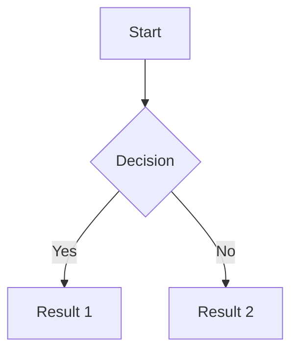
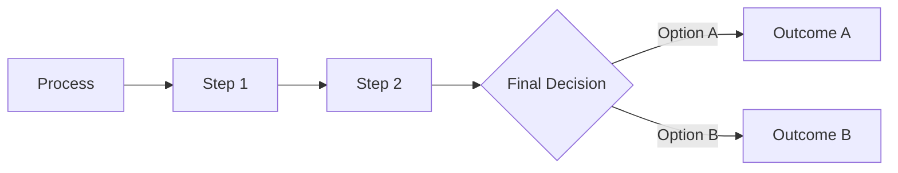
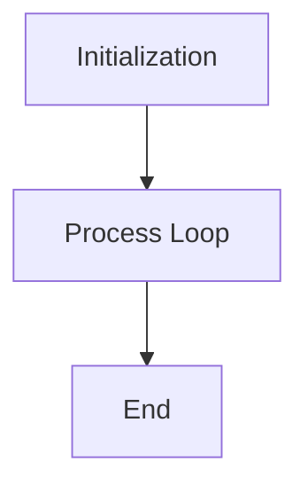

# Flowchart Guide

This document provides guidelines for creating flowcharts using Mermaid syntax.

### Additional Examples

## Notes
- Ensure clarity in your flowchart.
- Use descriptive names for each node.