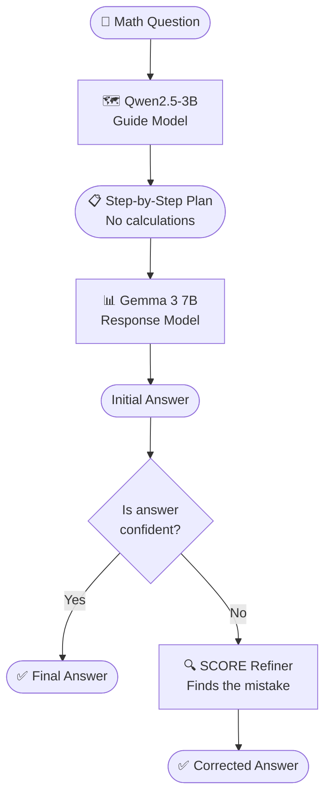
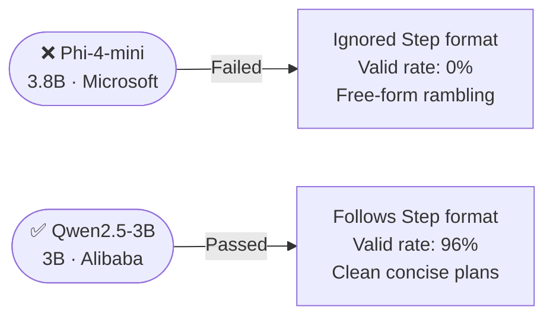
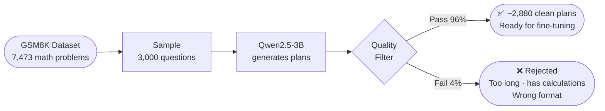
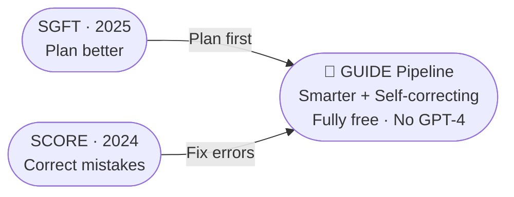
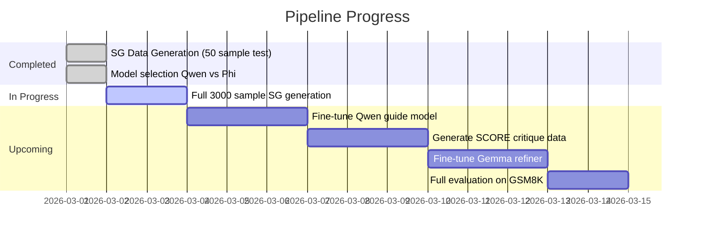

# Enhancing Small Language Models Without Big AI
### A Cost-Free Reasoning & Self-Correction Pipeline
*Prepared for presentation — March 2026*

---

## 🧠 The Problem We're Solving

Large AI models like GPT-4 are powerful — but expensive, closed, and inaccessible for research. **Small Language Models (SLMs)** are free and open, but they struggle with reasoning tasks like math.

> **Goal:** Make small models smarter — using only free tools, no paid APIs.

---

## 🔬 Research Foundation

This pipeline is built on two published papers:

| Paper | Venue | Core Idea |
|---|---|---|
| **SGFT** — Solution Guidance Fine-Tuning | COLING 2025 | Train a small model to *plan*, not calculate |
| **SCORE** — Self-COrrection in REasoning | ACL Findings 2024 | Train a small model to *find and fix its own mistakes* |

---

## ⚙️ The Pipeline — How It Works

---

## 🤖 Model Selection: What Worked and What Didn't

A key discovery during implementation was that **not all small models follow instructions equally**.

**Why Phi-4-mini failed:** It is a *reasoning* model — trained to think deeply and verbosely. When asked to write short structured plans, it ignored the format entirely and generated rambling paragraphs.

**Why Qwen2.5-3B works:** It is an *instruction-following* model — trained to obey format constraints precisely. It outputs clean `Step 1: ... Step 2: ...` plans consistently.

> 💡 **Key insight:** For plan generation, instruction-following ability matters more than raw reasoning power.

---

## 📊 Data Generation Strategy

**Why this matters:** The original SGFT paper used GPT-4o (a paid API) to generate plans. Our approach replaces this entirely with a free open-source model — making the full pipeline **zero cost**.

---

## 🆕 Our Novel Contribution

Neither paper combined these two methods. We are the first to propose:

**What's novel:**
- SGFT improves *initial reasoning* by planning first
- SCORE improves *error recovery* by critiquing mistakes
- Combined, they target two different failure points simultaneously
- **Replacing GPT-4 verifier** with ensemble voting (free alternative)

---

## 💻 Technical Stack

| Component | Model | Role | Parameters |
|---|---|---|---|
| Guide Model | Qwen2.5-3B-Instruct | Generates plans | 3B |
| Response Model | Gemma 3 7B | Executes plans → answers | 7B |
| Refiner | Gemma 3 7B (fine-tuned) | Corrects wrong answers | 7B |
| Verifier | Ensemble voting | Decides when to self-correct | Free |
| **Platform** | Kaggle Free GPU | P100 16GB | **$0 cost** |

---

## 📈 Expected Results

Based on the original papers, after combining both methods:

| Model | Before Pipeline | After SGFT | After SGFT + SCORE |
|---|---|---|---|
| GSM8K accuracy | ~36% baseline | ~48% | ~52–55% (projected) |
| Math transfer (MATH) | ~27% | ~35% | ~40% (projected) |

> *Projections based on individual paper results. Combined results pending full experimental run.*

---

## 🔭 Current Status & Next Steps

---

## 📚 References

1. **SGFT:** *"Enhancing the Reasoning Capabilities of Small Language Models via Solution Guidance Fine-Tuning"* — COLING 2025, pages 9074–9084.

2. **SCORE:** Zhang, Y., Khalifa, M., Logeswaran, L., Kim, J., Lee, M., Lee, H., & Wang, L. *"Small Language Models Need Strong Verifiers to Self-Correct Reasoning"* — Findings of ACL 2024, pages 15637–15653. University of Michigan / LG AI Research.

3. **ISC:** Han, H., Liang, J., Shi, J., He, Q., & Xiao, Y. *"Small Language Model Can Self-Correct"* — AAAI 2024, pages 18162–18170.

4. **GSM8K Dataset:** Cobbe, K. et al. *"Training Verifiers to Solve Math Word Problems"* — arXiv:2110.14168, 2021.

5. **Qwen2.5:** *"Qwen2.5 Technical Report"* — Alibaba Cloud, 2024. `Qwen/Qwen2.5-3B-Instruct`

6. **Gemma 3:** Google DeepMind. *"Gemma: Open Models Based on Gemini Research and Technology"* — arXiv:2403.08295, 2024.

---

*Pipeline implementation: Kaggle Free GPU (Tesla P100 16GB) · Total compute cost: $0*
