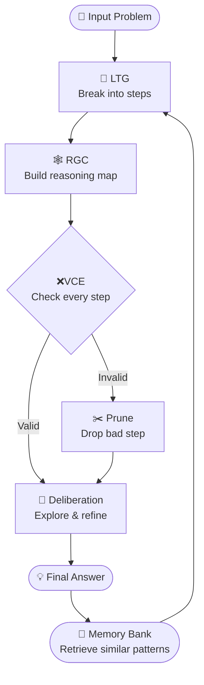

# 📋 SLD-VM — Plain English Summary

> **One sentence:** SLD-VM is a smarter way to get small, efficient AI models to reason through hard problems — without making the model bigger.
> 

---

## 🤔 What Problem Does It Solve?

Small AI models are cheap, fast, and work on everyday devices — but they make mistakes when problems need many steps of thinking. Once they get one step wrong, every step after it fails too. SLD-VM fixes this by giving the model a structured checklist, a fact-checker, and a memory — like replacing a notepad with a proper whiteboard that catches errors as they happen.

---

## 📊 Data Flow

---

## 🔧 The 5 Stages — Simply Explained

### 1 · 🧠 LTG — Break It Down

*Latent Thought Generation*

Instead of tackling a problem in one go, the model first splits it into small, numbered steps — like turning a recipe into individual instructions. Each step is simple enough to check on its own. If memory has seen a similar problem before, those past steps are shown as a helpful starting hint.

---

### 2 · 🕸️ RGC — Draw the Map

*Reasoning Graph Construction*

The steps are connected into a visual map showing which ideas depend on which. This means the model can follow multiple paths at the same time rather than being locked into one direction. If one path hits a dead end, the others keep going.

---

### 3 · ✅ VCE — Check the Work

*Verifier / Consistency Engine*

Every step is checked at three levels: is this step correct on its own? Does it logically follow from the step before? Does it contradict anything else on the map? Steps that fail are cut before they cause further damage — reducing factual mistakes by 8× compared to no checking.

---

### 4 · 🔄 Deliberation — Try Again If Needed

*Graph-Level Search & Backtracking*

If a step is cut, the model doesn't give up — it backtracks to the last good step and tries an alternative route. This is how humans solve problems too: hit a dead end, go back, try differently. This alone recovers 67% of problems that would otherwise fail.

---

### 5 · 💾 VMB — Remember What Worked

*Verifiable Memory Bank*

Every successful solution is saved with a reliability score. Next time a similar problem appears, the model pulls up the relevant steps as a head start. The more problems solved, the faster and better it gets — without any retraining or updates to the model itself.

---

---