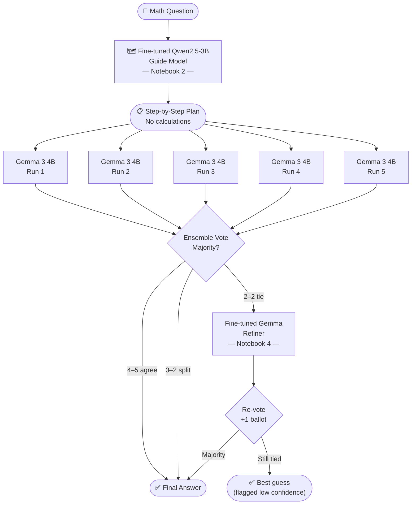
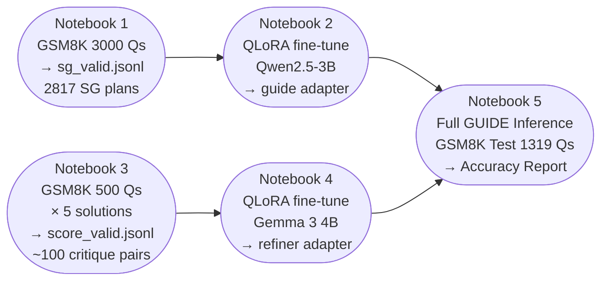
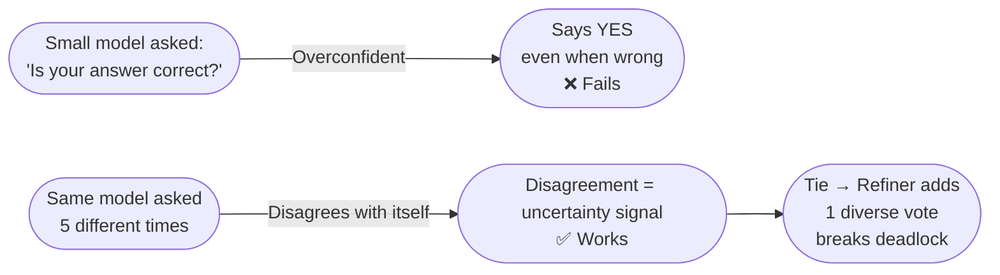

# GUIDE Pipeline — Overview & Methodology
### *Guided reasoning with Unified Instruction-following and Dynamic Error-correction*
*Enhancing Small Language Models for Mathematical Reasoning · March 2026*

---

## What Problem Does This Solve?

Small Language Models (SLMs) are free and run on consumer hardware — but fail at multi-step math reasoning. Large models like GPT-4 solve this, but are expensive and closed. **GUIDE combines two published methods to close this gap at zero cost.**

## Research Foundation

| Paper | Venue | Contribution to GUIDE |
|---|---|---|
| **SGFT** — Solution Guidance Fine-Tuning | COLING 2025 | Plan before solving — decompose problems into steps |
| **SCORE** — Self-COrrection in REasoning | ACL Findings 2024 | Recover from wrong answers via critique and correction |

**Novel contribution:** First pipeline to combine SGFT + SCORE. Replaces GPT-4 dependency with (1) a fine-tuned small guide model and (2) ensemble voting as a free verifier.

---

## The Five Notebooks

**Notebook 1 — SG Data Generation**
Uses base Qwen2.5-3B-Instruct to generate 3,000 Solution Guidance plans from GSM8K. Each plan is a 2–5 step decomposition with no calculations — only reasoning structure. Output: `sg_valid.jsonl` (~2,817 clean plans, 96% valid rate).

**Notebook 2 — Fine-tune Guide Model**
QLoRA fine-tunes Qwen2.5-3B on the SG pairs so the model permanently learns the plan format. Only 0.96% of parameters are trained (LoRA r=16). Output: `guide_model/final_adapter` (119 MB adapter weights).

**Notebook 3 — SCORE Data Generation**
Uses base Gemma 3 4B to generate wrong solutions at high temperature, then produces structured critiques (Error step / Reason / Correction) and verified corrected solutions for each. Output: `score_valid.jsonl` (~60–100 valid pairs per 200 questions).

**Notebook 4 — Fine-tune Refiner Model** *(upcoming)*
QLoRA fine-tunes Gemma 3 4B on the critique-correction pairs so it learns to generate diverse reasoning paths when called as a tiebreaker. This model is only invoked when ensemble voting produces a tie.

**Notebook 5 — Full Pipeline Inference & Evaluation** *(upcoming)*
Runs the complete GUIDE pipeline on GSM8K test set (1,319 questions). The fine-tuned guide generates a plan, Gemma solves it 5 times, and majority vote decides the answer. On ties, the fine-tuned refiner casts a deciding vote. Reports accuracy by strategy and confidence.

---

## Expected Results

| Benchmark | Baseline (no pipeline) | After SGFT | After GUIDE (SGFT + SCORE) |
|---|---|---|---|
| GSM8K | ~36% | ~48% | ~52–55% *(projected)* |
| MATH | ~27% | ~35% | ~40% *(projected)* |

*Platform: Kaggle Free GPU (Tesla P100/T4 16GB) · Total compute cost: $0*

# GUIDE Pipeline — Visual Architecture

---

## Full Pipeline Flow

---

## Training Data Construction

---

## Why Ensemble Voting Over Self-Verification

---

*GUIDE pipeline · SGFT (COLING 2025) + SCORE (ACL 2024) · Qwen2.5-3B + Gemma 3 4B · Kaggle Free GPU · $0*

